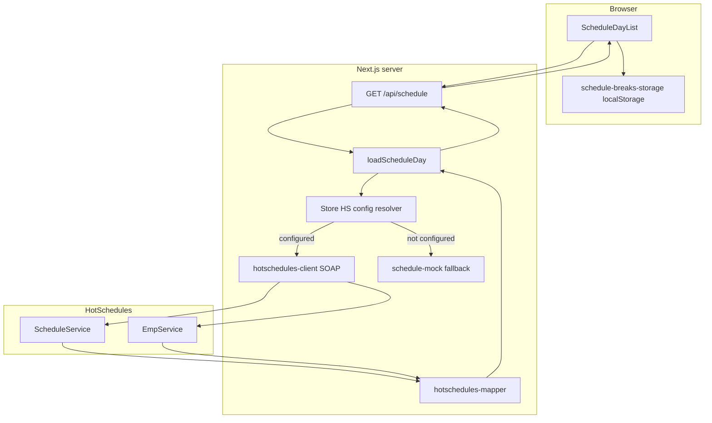

# HotSchedules integration — plan & architecture

This document describes how Train Trackr will integrate with **HotSchedules (Fourth)** for the **Schedule** tab. It summarizes decisions from product/architecture discussions and points to the official API reference in this folder.

**Official reference:** [`SOAP Web Services API Documentation.pdf`](./SOAP+Web+Services+API+Documentation.pdf) (v3.0)

**Related code today:**

| Layer | Path | Role |
|-------|------|------|
| UI | `src/components/ScheduleDayList.tsx` | Today's roster table; break checkboxes |
| API route | `src/app/api/schedule/route.ts` | Auth + `?profile=` + `?date=` |
| Server boundary | `src/lib/schedule-server.ts` | `loadScheduleDay()` — swap mock → HS here |
| Types & break rules | `src/lib/schedule.ts` | `ScheduleEmployee`, `computeShiftBreakSlots()` |
| Mock data | `src/lib/schedule-mock.ts` | Dev/fallback until HS is configured |
| Break persistence (client) | `src/lib/schedule-breaks-storage.ts` | localStorage until DB-backed breaks exist |

---

## Goals

1. Show **who is scheduled today** per **Train Trackr store** and **active profile** (e.g. FOH Manchester Crenshaw).
2. Display **shift time frame**, **duration**, and **break slots** (30m / 10m / 10m) using Train Trackr break rules.
3. Keep **HotSchedules credentials and SOAP calls server-only** — never in the browser.
4. **Roll out gradually:** mock data remains for stores/profiles without HS config.
5. **Future:** each store owner can connect **their own** HS username/password (separate virtual stores, separate API calls).

Non-goals for the first integration:

- Writing data back to HotSchedules (`setEmps`, `setTimeCards`, etc.).
- Full HS feature parity (labor, sales, time-off, certifications).
- Day navigation in the UI (today-only for now; API still accepts `date` for caching/sync).

---

## Background: SOAP, concept, and storeNum

### What is SOAP?

HotSchedules exposes a **SOAP** API, not REST/JSON. Calls are **XML envelopes** over HTTPS, with a **WS-Security `UsernameToken`** header (username + password). Each “service” has its own WSDL URL, e.g.:

- Schedule: `https://services.hotschedules.com/api/services/ScheduleService?wsdl`
- Employees: `https://services.hotschedules.com/api/services/EmpService?wsdl`

In Next.js we use a **server-side SOAP client** (or hand-built XML) inside API routes / `schedule-server.ts`. The React app continues to call `/api/schedule` as it does today.

### What is `concept`?

`concept` is HotSchedules’ integer ID for a **brand / company group** within your HS account. It is **not** a Train Trackr profile and not a single employee.

### What is `storeNum`?

`storeNum` is the integer ID for a **specific store/location** within that concept (e.g. one CFA restaurant).

### Required on almost every call

| Parameter | Meaning |
|-----------|---------|
| `concept` | HS brand/group ID (unique within company) |
| `storeNum` | HS store ID (unique within concept) |

Values are assigned by HotSchedules and must match **exactly**. See the PDF: *Introduction*, *Getting started*, *Testing*.

### Train Trackr mapping

| Train Trackr | HotSchedules | Notes |
|--------------|--------------|--------|
| `Store` (e.g. “CFA Stanley Webster”) | `concept` + `storeNum` (+ credentials) | One Train Trackr store → one HS store connection |
| `StoreProfile` (e.g. FOH, Manchester Crenshaw) | Optional filters: `scheduleId`, job codes, `locationId` | Profiles are app-scoped; HS may use schedule names/locations/jobs |
| `User` / role | — | VIEWER cannot toggle breaks; unrelated to HS API login |
| Schedule tab “today” | `start` = `end` = business date | `hsSimpleDate` { day, month, year } in V3 methods |

---

## What we read from HotSchedules

For the Schedule tab, the primary service is **`ScheduleService`** (PDF § ScheduleService Web Service).

### Recommended methods

| Method | Use |
|--------|-----|
| **`getScheduleV3`** | Shifts for a date range; returns `wsScheduleItem3[]` with `inDate`/`inTime`, `outDate`/`outTime`, `regMinutes`, employee/job IDs |
| **`getShiftsV3`** | Same shift shape, plus flags: `isPosted`, `isScheduled`, `isHouse`, optional `jobCodes` |

**Suggested filters for “today’s posted roster”:**

- `isPosted: true` — shifts on schedules published in HS
- `isScheduled: true` — include saved schedules
- `isHouse: false` — exclude unassigned “house” shifts (unless product wants them later)
- `start` and `end` = same calendar day (today)

### Supporting methods

| Service | Method | Use |
|---------|--------|-----|
| `EmpService` | `getStoreEmployees` | Map `empPosId` / `empHSId` → display name |
| `ScheduleService` | `getLocations` | Optional: map HS locations to Train Trackr profiles |
| `TimeCardService` | `getTimeCards` | **Later** — actual punches / `breakMinutes`; not needed for planned schedule display |

### `wsScheduleItem3` fields (relevant)

From the PDF *Complex Types: ScheduleService*:

- `empHSId`, `empPosId` — employee identifiers
- `inDate`, `inTime`, `outDate`, `outTime` — shift window
- `regMinutes` — scheduled regular minutes → duration & break rules
- `scheduleId`, `jobHsId`, `jobPosId`, `locationId` — filtering / notes

Shifts do **not** include Train Trackr break checkbox state. Those remain **app workflow** (see below).

---

## Target architecture



### Request flow (configured store)

1. User opens Schedule tab; UI calls `/api/schedule?profile={profileKey}&date={YYYY-MM-DD}` (today).
2. Route authenticates Train Trackr user; resolves `storeId` and allowed `profileKey`.
3. `loadScheduleDay()` loads HS config for that **store** (+ optional **profile** overrides).
4. SOAP: `getShiftsV3` or `getScheduleV3` for the date; optionally `getStoreEmployees` for names (cached).
5. **Mapper** converts shifts → `ScheduleEmployee[]`:
   - `name` from employee lookup
   - `shiftTimeFrame` / `shiftDuration` from in/out times or `regMinutes`
   - Break **slots** via `computeShiftBreakSlots(durationHours)` in `src/lib/schedule.ts`
   - `shiftNotes` from job name / schedule name if useful
6. Response `source: "hotschedules"`.
7. UI merges **saved break checkbox state** (localStorage today → DB later).

### Integration boundary (do not bypass)

- **All HS HTTP/SOAP** → new server-only modules imported by `schedule-server.ts`.
- **`/api/schedule/route.ts`** stays thin: auth, profile, date validation, call `loadScheduleDay()`.
- **UI types** stay in `src/lib/schedule.ts`; components do not import SOAP libraries.

---

## Data mapping: HS shift → `ScheduleEmployee`

| `ScheduleEmployee` | Source |
|--------------------|--------|
| `id` | Stable: `hs-{empHSId}-{shiftId}` or similar |
| `name` | `getStoreEmployees` → `FName` + `LName` |
| `shiftTimeFrame` | `formatShiftTimeFrame()` from `inDate`+`inTime`, `outDate`+`outTime` |
| `shiftDuration` | `regMinutes / 60` or computed from in/out |
| `break30Min` / `break10Min*` | **`computeShiftBreakSlots(durationHours)`** — slots only; `false` = unchecked |
| `shiftNotes` | Job name, schedule name, or empty |

Break **checkbox toggles** are **not** from HotSchedules schedule API. They track whether staff took earned breaks during the shift (operational). Optional future: reconcile with `TimeCardService` `breakMinutes` for actual punches.

### Break rules (Train Trackr)

Defined in `computeShiftBreakSlots()` (`src/lib/schedule.ts`):

| Shift length | Break slots |
|--------------|-------------|
| &lt; 3.5 h | None |
| 3.5–6 h | One 10 min |
| ≥ 5 h | 30 min (plus any 10s from rows above) |
| &gt; 6 h | Two 10 min (plus 30 min if ≥ 5 h) |

If a slot does not apply, omit the field — UI hides that checkbox.

---

## Credentials & multi-tenant plan

### Phase 1 — Development / single store (near term)

- Env vars on Vercel/local, e.g. `HOTSCHEDULES_USERNAME`, `HOTSCHEDULES_PASSWORD`, `HOTSCHEDULES_CONCEPT`.
- Per-store `storeNum` in env or a single row in DB for the pilot store.
- Mock fallback for all other stores.

### Phase 2 — Per-store owner setup (future)

Each **Train Trackr `Store`** gets its own HS connection so virtual stores never share another store’s credentials or `storeNum`.

Planned model (additive migration — **not implemented yet**):

```
StoreHotschedulesConfig (or fields on StoreSetting)
  storeId          → Store
  username         → encrypted
  password         → encrypted
  concept          → int
  storeNum         → int
  enabled          → boolean
  lastSyncAt       → optional
  lastError        → optional

StoreProfileHotschedulesMapping (optional)
  storeProfileId   → StoreProfile
  scheduleId       → filter HS shifts
  jobCodes         → int[] filter
  locationId       → filter
```

**Settings UI (future):** OWNER/ADMIN enters HS username, password, concept, storeNum; test connection; map profiles to HS schedules/jobs.

**Security:**

- Encrypt secrets at rest; decrypt only in server routes.
- Never return credentials to the client or log them.
- Do not commit credentials to git or `docs/`.

---

## Planned server modules (to be created)

```
src/lib/hotschedules/
  client.ts          # SOAP envelope, UsernameToken, call ScheduleService / EmpService
  types.ts           # wsScheduleItem3, hsSimpleDate, hsSimpleTime (from WSDL/PDF)
  mapper.ts          # shift + employee → ScheduleEmployee
  config.ts          # resolve concept/storeNum/credentials for storeId (+ profile)
  cache.ts           # optional: short TTL cache per store/date/profile
```

`schedule-server.ts` orchestrates:

```ts
// Pseudocode
async function loadScheduleDay(storeId, profileKey, profileName, dateKey) {
  const config = await getHotschedulesConfig(storeId, profileKey);
  if (!config?.enabled) {
    return mockOrEmpty(profileName, dateKey);
  }
  const shifts = await hsClient.getShiftsV3(config, dateKey, { isPosted: true, ... });
  const employees = await hsMapper.toScheduleEmployees(shifts, config);
  return { ..., employees, source: "hotschedules" };
}
```

---

## Caching & reliability

| Concern | Approach |
|---------|----------|
| Rate limits / latency | Cache shift + employee list per `storeId` + `date` (e.g. 5–15 min) |
| HS downtime | Show last good cache + banner; or graceful empty state with error message |
| Wrong concept/storeNum | Log server-side; show “Schedule not configured” in UI |
| SSL | HS uses `services.hotschedules.com` with standard HTTPS; PDF mentions GoDaddy certs for legacy Java clients — verify Node fetch first |

---

## Rollout strategy

1. **Mock only** (current) — `source: "mock"` for profiles matching mock name rules.
2. **Pilot store** — env-based credentials; one `storeNum`; one or all profiles.
3. **Profile-level filters** — map `StoreProfile.key` → `scheduleId` / jobs.
4. **Owner self-serve** — Settings → HotSchedules connection per store.
5. **Break state in DB** — replace `localStorage` for multi-device sync.

Keep `UnderDevelopmentNotice` on the Schedule tab until pilot is validated in production.

---

## What you need from HotSchedules (checklist)

Contact your **HotSchedules account manager** (per PDF *How to request a username/password*):

- [ ] API **username** and **password** (UsernameToken)
- [ ] **Test site** with known **`concept`** and **`storeNum`**
- [ ] Confirmation which method to use for published daily schedule (`getShiftsV3` flags)
- [ ] How **FOH / BOH / schedules** in HS map to jobs or `scheduleId` (for profile filtering)
- [ ] Whether a **newer Fourth API** exists beyond this SOAP v3 doc

Testing (per PDF *Testing*):

- Verify shifts returned for a date match what you see in the HS UI for that store.
- Use test site on production HS servers before touching live customer data.

---

## Milestones

| # | Deliverable | Status |
|---|-------------|--------|
| 1 | Schedule UI + types + mock + break rules | Done |
| 2 | Architecture doc (this file) | Done |
| 3 | `hotschedules-client` + `getScheduleV3`/`getShiftsV3` for one day | Planned |
| 4 | Employee name resolution (`getStoreEmployees`) | Planned |
| 5 | Env-based pilot for one Train Trackr store | Planned |
| 6 | DB config + Settings UI for store owners | Future |
| 7 | DB-backed break checkbox state | Future |
| 8 | Optional: time card / break reconciliation | Future |

---

## References

- [`SOAP+Web+Services+API+Documentation.pdf`](./SOAP+Web+Services+API+Documentation.pdf) — source of truth for methods and types
- [`README.md`](./README.md) — what belongs in this folder
- [`AGENTS.md`](../../../AGENTS.md) — agent rules for HS work
- HotSchedules Schedule WSDL: `https://services.hotschedules.com/api/services/ScheduleService?wsdl`
- HotSchedules Emp WSDL: `https://services.hotschedules.com/api/services/EmpService?wsdl`
