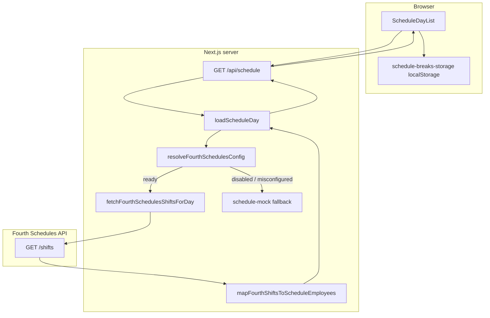

# HotSchedules / Fourth Schedules integration — plan & architecture

This document describes how Train Trackr integrates with **Fourth Workforce Management** (HotSchedules) for the **Schedule** tab.

**Official reference (current):** [Fourth Schedules API Guide](https://developer.fourth.com/en-gb/docs/schedules-api/guide)

**Legacy (do not use for new work):** [`SOAP+Web+Services+API+Documentation.pdf`](./SOAP+Web+Services+API+Documentation.pdf) — superseded by the REST Schedules API above.

**Related code today:**

| Layer | Path | Role |
|-------|------|------|
| UI | `src/components/ScheduleDayList.tsx` | Today's roster table; break checkboxes |
| API route | `src/app/api/schedule/route.ts` | Auth + `?profile=` + `?date=` |
| Server boundary | `src/lib/schedule-server.ts` | `loadScheduleDay()` — mock vs Fourth API |
| Fourth client | `src/lib/hotschedules/` | REST client, config, mapper |
| Types & break rules | `src/lib/schedule.ts` | `ScheduleEmployee`, `computeShiftBreakSlots()` |
| Mock data | `src/lib/schedule-mock.ts` | Dev/fallback until Fourth is configured |
| Break persistence (client) | `src/lib/schedule-breaks-storage.ts` | localStorage until DB-backed breaks exist |

---

## Goals

1. Show **who is scheduled today** per **Train Trackr store** and **active profile** (e.g. FOH Manchester Crenshaw).
2. Display **shift time frame**, **duration**, and **break slots** (30m / 10m / 10m) using Train Trackr break rules.
3. Keep **Fourth credentials and API calls server-only** — never in the browser.
4. **Roll out gradually:** mock data remains for stores/profiles without Fourth config.
5. **Future:** each store owner can connect **their own** Fourth credentials (separate virtual stores, separate API calls).

Non-goals for the first integration:

- Writing data back to Fourth.
- Full WFM feature parity (labor, sales, time-off, certifications).
- Day navigation in the UI (today-only for now; API still accepts `date` for caching/sync).

---

## Fourth Schedules API (REST)

### Quick facts

| Item | Detail |
|------|--------|
| Type | HTTP REST with JSON |
| Auth | **Basic Authentication** (username + password) |
| Resource | `GET <ROOT>/shifts` |
| Data | **Published** assigned shifts only (My Schedule); open shifts not included |
| Times | Returned in **UTC** |
| Shift day | Each shift belongs to the **day it ends** (`workDate`) |

### Date range query

For a single calendar day (`YYYY-MM-DD`), convert to `YYYYMMDD` and call:

```
GET <ROOT>/shifts?fromDate=20190101&toDate=20190101
```

Both parameters are inclusive. For overnight shifts ending after midnight, query the **end day** (see Fourth troubleshooting in the guide).

Alternative: `daysInPast` / `daysInFuture` relative to today — we use explicit `fromDate`/`toDate` for the Schedule tab's chosen date.

### Response shape (per shift)

| Field | Use in Train Trackr |
|-------|---------------------|
| `fourthAccountId` | Stable employee key; future UK Employee API lookup |
| `startDateTime`, `endDateTime` | Shift window (UTC → local display) |
| `workDate` | Filter rows for requested day |
| `roleName` | Display name until employee names are resolved |
| `departmentName`, `locationName` | Notes / future profile filtering |
| `breakMinutes` | Scheduled break length (informational in `shiftNotes`) |
| `locationTnAId` | Location identifier (future store mapping) |

**Important:** The Schedules API does **not** return employee first/last names. Use [UK Employee API](https://developer.fourth.com/en-gb/docs/uk-employee-api/guide) later to map `fourthAccountId` → display name.

### Credentials

Your mutual Fourth customer requests a **Schedules API account** and **root URL** via their Fourth Professional Services contact. Set these in server env (see `.env.example`).

---

## Target architecture



### Request flow (configured)

1. User opens Schedule tab; UI calls `/api/schedule?profile={profileKey}&date={YYYY-MM-DD}` (today).
2. Route authenticates Train Trackr user; resolves `storeId` and allowed `profileKey`.
3. `loadScheduleDay()` checks `FOURTH_SCHEDULES_ENABLED` and env credentials.
4. REST: `GET /shifts?fromDate=&toDate=` for the date; filter by `workDate`.
5. **Mapper** converts shifts → `ScheduleEmployee[]`:
   - `name` from `roleName` (until UK Employee API enrichment)
   - `shiftTimeFrame` / `shiftDuration` from parsed UTC datetimes
   - Break **slots** via `computeShiftBreakSlots(durationHours)`
   - `shiftNotes` from department, location, scheduled break minutes
6. Response `source: "hotschedules"`.
7. UI merges **saved break checkbox state** (localStorage today → DB later).

### Integration boundary (do not bypass)

- **All Fourth HTTP** → `src/lib/hotschedules/*`, imported only from `schedule-server.ts`.
- **`/api/schedule/route.ts`** stays thin: auth, profile, date validation, call `loadScheduleDay()`.
- **UI types** stay in `src/lib/schedule.ts`; components do not import the Fourth client.

---

## Data mapping: Fourth shift → `ScheduleEmployee`

| `ScheduleEmployee` | Source |
|--------------------|--------|
| `id` | `fourth-{fourthAccountId}-{startDateTime}` |
| `name` | `roleName` (UK Employee API later) |
| `shiftTimeFrame` | Local time from `startDateTime` / `endDateTime` |
| `shiftDuration` | Computed hours between start and end |
| `break30Min` / `break10Min*` | **`computeShiftBreakSlots(durationHours)`** — slots only; `false` = unchecked |
| `shiftNotes` | `departmentName`, `locationName`, optional break minutes |

Break **checkbox toggles** are **not** from the Schedules API. They track whether staff took earned breaks during the shift (operational).

### Break rules (Train Trackr)

Defined in `computeShiftBreakSlots()` (`src/lib/schedule.ts`):

| Shift length | Break slots |
|--------------|-------------|
| &lt; 3.5 h | None |
| 3.5–6 h | One 10 min |
| ≥ 5 h | 30 min (plus any 10s from rows above) |
| &gt; 6 h | Two 10 min (plus 30 min if ≥ 5 h) |

If a slot does not apply, omit the field — UI hides that checkbox.

---

## Environment variables

| Variable | Required when enabled | Purpose |
|----------|----------------------|---------|
| `FOURTH_SCHEDULES_ENABLED` | — | `true` to use live API; otherwise mock |
| `FOURTH_SCHEDULES_API_ROOT_URL` | Yes | Base URL for `/shifts` |
| `FOURTH_SCHEDULES_USERNAME` | Yes | Basic auth username |
| `FOURTH_SCHEDULES_PASSWORD` | Yes | Basic auth password |

**Legacy aliases:** `HOTSCHEDULES_ENABLED`, `HOTSCHEDULES_USERNAME`, `HOTSCHEDULES_PASSWORD` still work for enable/username/password. `HOTSCHEDULES_CONCEPT` and `HOTSCHEDULES_STORE_NUM` are **no longer used** (SOAP-only).

---

## Credentials & multi-tenant plan

### Phase 1 — Development / single store (current)

- Env vars on Vercel/local (see table above).
- Mock fallback when disabled or misconfigured.

### Phase 2 — Per-store owner setup (future)

Each **Train Trackr `Store`** gets its own Fourth connection.

Planned model (additive migration — **not implemented yet**):

```
StoreFourthSchedulesConfig
  storeId          → Store
  apiRootUrl       → string
  username         → encrypted
  password         → encrypted
  enabled          → boolean
  lastSyncAt       → optional
  lastError        → optional

StoreProfileFourthMapping (optional)
  storeProfileId   → StoreProfile
  departmentName   → filter shifts
  locationName     → filter shifts
```

**Settings UI (future):** OWNER/ADMIN enters credentials; test connection; map profiles to departments/locations.

**Security:**

- Encrypt secrets at rest; decrypt only in server routes.
- Never return credentials to the client or log them.
- Do not commit credentials to git or `docs/`.

---

## Server modules

```
src/lib/hotschedules/
  constants.ts       # Env key names, guide URL
  config.ts          # resolveFourthSchedulesConfig()
  client.ts          # GET /shifts with Basic auth
  types.ts           # FourthShift, credentials
  mapper.ts          # shift → ScheduleEmployee
```

`schedule-server.ts` orchestrates mock vs Fourth based on config.

---

## Caching & reliability

| Concern | Approach |
|---------|----------|
| Rate limits / latency | Optional short TTL cache per store/date (future) |
| Fourth downtime | Show API error banner; empty roster |
| Wrong credentials / URL | HTTP 4xx/5xx → `integration.state: api_error` |
| No published shifts | Empty array (normal if My Schedule not published) |
| UTC / midnight shifts | Query the day the shift **ends**; parse UTC datetimes to local |

---

## Rollout strategy

1. **Mock only** — `source: "mock"` when `FOURTH_SCHEDULES_ENABLED` is not true.
2. **Pilot store** — env-based credentials; validate against HS UI for same day.
3. **Profile-level filters** — map `StoreProfile` → `departmentName` / `locationName`.
4. **Employee names** — UK Employee API enrichment via `fourthAccountId`.
5. **Owner self-serve** — Settings → Fourth connection per store.
6. **Break state in DB** — replace `localStorage` for multi-device sync.

Keep `UnderDevelopmentNotice` on the Schedule tab until pilot is validated in production.

---

## What you need from Fourth (checklist)

Contact your **Fourth account manager** / Professional Services:

- [ ] Schedules API **username** and **password**
- [ ] API **root URL** for `GET /shifts`
- [ ] Test environment or pilot store with published My Schedule shifts
- [ ] How **FOH / BOH / departments** in Fourth map to `departmentName` (for profile filtering)
- [ ] UK Employee API access if display names are required (not in Schedules API response)

Testing:

- Verify shifts for a date match what you see in My Schedule for that location.
- Confirm overnight shifts appear on the **end** day's query.

---

## Milestones

| # | Deliverable | Status |
|---|-------------|--------|
| 1 | Schedule UI + types + mock + break rules | Done |
| 2 | Architecture doc (this file) | Done |
| 3 | Fourth REST client + `GET /shifts` for one day | Done |
| 4 | Employee name resolution (UK Employee API) | Future |
| 5 | Env-based pilot for one Train Trackr store | Ready to configure |
| 6 | DB config + Settings UI for store owners | Future |
| 7 | DB-backed break checkbox state | Future |
| 8 | Profile filters (`departmentName` / `locationName`) | Future |

---

## References

- [Schedules API Guide](https://developer.fourth.com/en-gb/docs/schedules-api/guide) — **source of truth**
- [Schedules API Reference](https://developer.fourth.com/en-gb/docs/schedules-api/reference)
- [UK Employee API Guide](https://developer.fourth.com/en-gb/docs/uk-employee-api/guide) — future name enrichment
- [`SOAP+Web+Services+API+Documentation.pdf`](./SOAP+Web+Services+API+Documentation.pdf) — legacy SOAP v3 (archived)
- [`README.md`](./README.md) — what belongs in this folder
- [`AGENTS.md`](../../../AGENTS.md) — agent rules for schedule integration work
